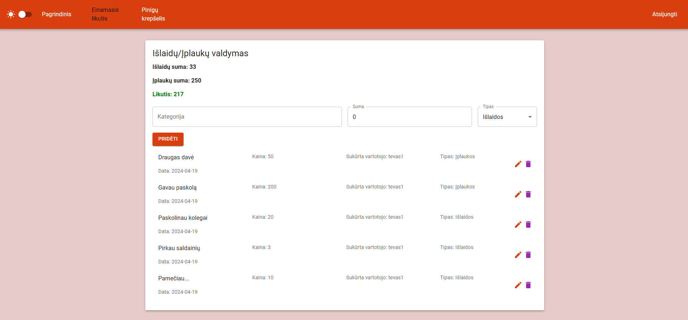

## Šeimos buhalterinė sistema

Užduotis yra padaryti šeimos ūkio buhalterinės apskaitos sistemą, kuri leistų
naudotojams sekti jų išlaidas ir įplaukas, jas pridėti ir matyti apibendrintą vaizdą. Šioje
svetainėje bus trijų rolių vartotojai: IS naudotojas (Vaikai), Administratorius (Tėvai) ir Demo naudotojas. IS
naudotojas galės prisiregistruoti ir pilnai naudoti sistemą, jo įrašai bus saugomi duomenų
bazėje ir juos bus galima naudoti. Administratorius turi galimybę skaityt IS naudotojų įrašus.
Demo naudotojas galės naudoti sistemą, tik jo pakeitimai nebus saugomi duomenų bazėje ir
sistema jam atitiks demo versiją.

### Funkciniai reikalavimai

Neregistruotas sistemos naudotojas gales:

* Peržiūrėti sistemos pradinį puslapį.
* Prisijungti/Registruotis į sistemą.

Registruotas naudotojas galės (vaikas):

* Atsijungti nuo sistemos.
* Tvarkyti savo įplaukas.
* Tvarkyti savo išlaidas.
* Matyti savo finansinį grafiką.

Registruotas naudotojas galės (tėvas):

* Atsijungti nuo sistemos.
* Tvarkyti savo įplaukas.
* Tvarkyti savo išlaidas.
* Matyti savo finansinį grafiką.
* Matyti vaikų finansinius grafikus.
* Matyti vaikų išlaidas.
* Matyti vaikų įplaukas.

### Sistemos realizacijai naudojamos technologijos

* Front end – React.js (Javascript)
* Back end – .Net
* DataBase – MySQLite (MySQL embedded)

